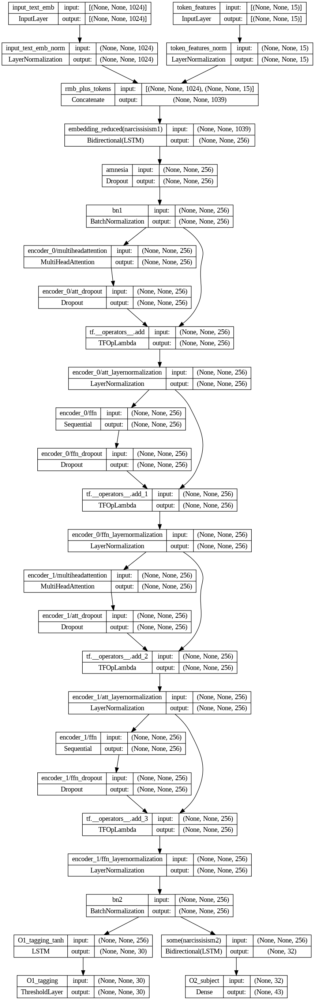

 

# Analyser core & nlp_tools

## CLI  
см. [основные команды для работы с анализатором](cli/README.md)

___

## Конве́йер анализатора
0. Пользователь предоставляет документы. 

2. Модуль [Parser](https://github.com/nemoware/document-parser) получает на вход документы Word и преобразует их в удобное внутреннее представление.
Его результаты попадают в Mongo DB. Документы ставятся в очередь на обработку.
   
2. Модуль анализатора вынимает из очереди документ. Тект разбивается на токены.

3. Текст нормализуется: убирается "мусор" -- непечатаемые символы, двойные пробелы, лишние дефисы, лишние переносы, т.п..  
   Регистр слов нормализуется на основе статистики (например, известные аббревиатуры переводятся в верхний регистр и т. д.).
   
4. Производится эмбеддинг (встраивание?) текста -- перевод токенов в векторное представление. 
   Для "встраивания" (русский, пощади!) мы используем предварительно обученную DeepPavlov модель ELMO.
   
5. Формируется матрица признаков токенов -- каждому токену 
   присваивается соотв. бинарный вектор, единицы в котором 
   указывают на наличие того или иного признака, например, 
   «лексема знака препинания», или «содержит только цифры», 
   или «начинается с прописной буквы» и т. д.
   
6. _Матрица эмбеддинга_ и _матрица признаков токенов_ подается на вход нейронной сети.
7. На выходе из сети -- 
   - _семантическая карта текста_ -- бинарная матрица, высота которой кратна количесву обнаружеваемых атрибутов, а длинна соотв. кол-ву токенов в тексте.
Единицами в строках матрицы помечены (подсвечены) зоны текста, соотв. атрибутам.
   - one-hot вектор, характеризующий предмет договора (классификация)
   
8. По _семантической карте текста_ определяются координаты 
   найденных признаков. Найденные значения атрибутов очищаются и нормализуются --
     например, кавычки вокруг названий компаний отрезаны,
     имена преобразовываются в стандартный регистр и т. д.
   
9. Найденные атрибуты записываются в виде дерева (Бодхи) в Mongodb 
10. Выявленные атрибуты документов используются далее на этапе Аудита и подготовки заключения.
   
## Некоторые подходы к обучению нейронной модели (в общих чертах)
### TL
- Мы полагаемся на предварительно обученные открытые модели третьих сторон, 
    применяются механизмы Transfer learning (TL).
### MTL
- Мы используем multi-task learning (MTL) подход к обучению, -- одни и те же веса 
    распределяются между классификацией предмета контракта и определением атрибутов.
### Обучающий набор   
3. Мы ограничено применяем так называемый протокол обучения Noisy Student -- 
    обучающий набор содержит небольшое количество документов, автоматически размеченных
    предыдущей версией модели, в то время как большинство документов размечены биологическими атропоморфными существами.
### Miscl   
- На некотором этапе обучения модель может сваливаться в локальные 
минимумы и плохо распознавать определенный признак,
    в то время как другая версия обученной модели может этот признак распозновать хорошо.
    В таком случае мы производим линейное взвешивание двух набораов весов, чтобы получить 
«комбинированный» набор отягощений, с которых продолжается тренировка.
   
- Поскольку некоторые документы слишком длинные, чтобы сразу поместиться во входной слой модели,
    мы анализируем их, применяя "движущееся окно" с перекрытием 20%. Перекрывающиеся края окон
    линейно взвешены.

### Расширение обучающего набора (augmentation)
- Размер входного тензора ограничен до 600. Мы случайным образом вырезаем из документа фрагмент длиной 600 токенов. К эмбеддингам  добавляется некоторое кол-во шума.

## Обучающий набор
TODO: 🚧

Обучающий набор является множеством структур json и содержится в Mongo DB.

Структура несет: 
- токенизированный текст, а именно -- координаты всех токенов. 
  Минимальной единицей является слово 
   
- Атрибуты, которые ссылаются на координаты токенов -- на начало и конец последовательности. Атрибуты выстроены в древовидную структуру.

5. Формируется семантическая карта текста -- бинарная матрица, высота которой кратна количесву обнаружеваемых атрибутов, а длинна соотв. кол-ву токенов в тексте.
Единицами в строках матрицы помечены зоны текста, соотв. атрибутам.


## Подготовка обучающего набора
TODO: 🚧  

1.  Первичный (грязный) обучающий набор был создан в полуавтоматическом режиме... 🚧  


## Архитектура нейронной модели

TODO: 🚧  




___

## Miscl. commands
- Create wheel: 
```
python setup.py bdist_wheel 
```
- Collect all wheels of the project: 
```
pip wheel -r requirements.txt --wheel-dir=tmp/wheelhouse
```
- Install collected wheels 
``` 
pip install --no-index --find-links=tmp/wheelhouse SomePackage 
```

## Assign a release tag:
1. Create a tag:
    ```                     
    > git tag -a vX.X.X -m "<release comment>"
    ```
1. Push tag:
    ```                     
    > git push origin --tags
    ```

## Usage (Windows):
1. Install Python >=3.6 and pip
1. Install ```virtualenv```( [https://virtualenv.pypa.io/en/latest/installation/]() ):
    ```
    > pip install virtualenv
    ```
1. Download ``` nemoware_analyzer-X.X.X-py3-none-any.whl ``` to working dir (e.g. ```analyser_home```)     
1. Change to the work dir:
    ```
    > cd analyser_home
    ```
1. Create virtual environment (with name ```venv```):
    ```
    > virtualenv venv
    ```
1. Activate:
    ``` 
    > .\venv\Scripts\activate
    ```
1. Install ```analyser``` with all deps:
    ```
    > pip install  .\nemoware_analyzer-X.X.X-py3-none-any.whl    
    ```
1. Run:

    ```
    > analyser_run
    ```


## Run analyzer as a service
1. Register systemd service
    ```
    > cd bin 
    > sudo ./install_service.sh 
    ```
1. Service commands
    ```
    sudo systemctl stop nemoware-analyzer.service          #To stop running service 
    sudo systemctl start nemoware-analyzer.service         #To start running service 
    sudo systemctl restart nemoware-analyzer.service       #To restart running service 
    ```
    
# CML 
### contintinous machine learning
CML is triggered only on push or pull request to `model` branch.  
refer https://github.com/nemoware/analyser/.github/workflows/cml.yaml

to run CML worker (just example, parameters may differ):

```
sudo docker run --name <ANYNAME> -d 
   -v ~/pip_cache:/pip_cache 
   -v ~/gpn:/gpn_cml 
   -e GPN_WORK_DIR=/gpn_cml   
   -e RUNNER_IDLE_TIMEOUT=18000  
   -e RUNNER_LABELS=cml,cpu   
   -e RUNNER_REPO=https://github.com/nemoware/analyser   
   -e repo_token=<personal github access token> 
   -e GPN_DB_HOST=192.168.10.36 
   -e PIP_DOWNLOAD_CACHE=/pip_cache    
   dvcorg/cml-py3
```

